# Olá, eu sou Felipe Cagnin! 👋

### Desenvolvedor Full Stack | Cursando Ciência da Computação (UNIP)

Unindo a precisão da formação técnica pelo **SENAI** com o aprofundamento acadêmico em **Ciência da Computação pela UNIP (Jundiaí)**. Minha atuação é focada no ecossistema **Laravel & Vue.js**, com forte interesse em arquitetura de sistemas, escalabilidade e a interação profunda entre software e hardware.

---

### 🚀 Especialidades & Foco Técnico

- **Backend & APIs:** Desenvolvimento de soluções robustas com **PHP (Laravel)** e **Node.js**, aplicando padrões de projeto e foco em segurança.
- **Frontend Moderno:** Interfaces reativas e performáticas com **Vue.js**, **React** e ecossistema mobile com **React Native**.
- **Data & Performance:** Estudo constante sobre otimização de bancos de dados relacionais e eficiência de algoritmos.
- **Infraestrutura:** Entendimento de redes, servidores e como o código impacta o ambiente físico de processamento.

---

### 🛠 Stack Tecnológica

#### Languages & Frameworks

#### Base & Web Essentials

---

### 📈 Estatísticas de Desenvolvedor

| GitHub Stats | Top Languages |
| :---: | :---: |
|  |  |

---

### 🤝 Conecte-se Comigo

*"Não há nada que não possa ser aprendido!"*
